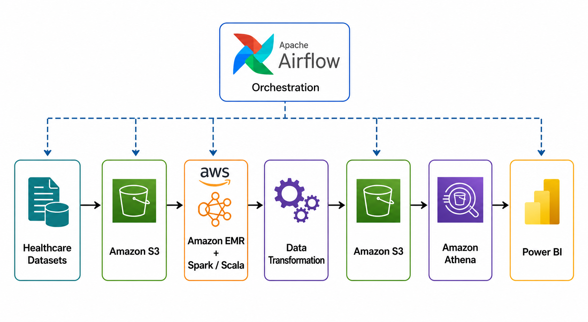
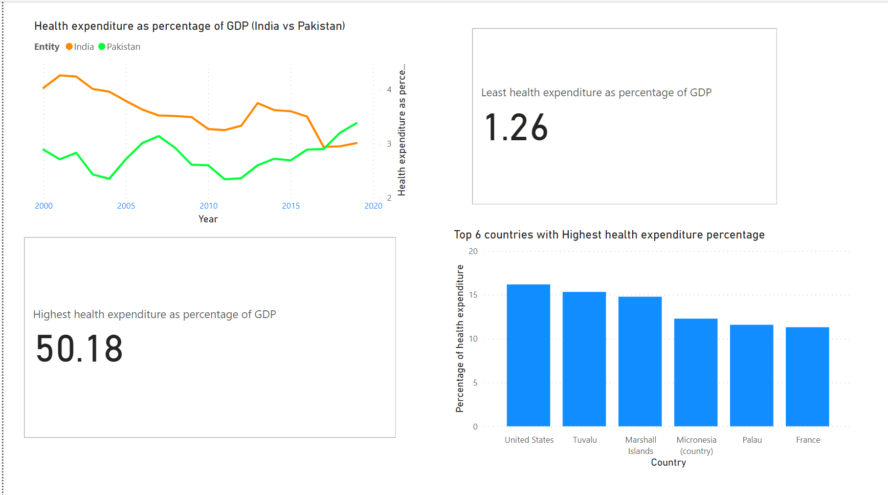

# Healthcare Data Engineering Pipeline

An end-to-end healthcare data engineering project that processes and analyzes healthcare datasets using **Apache Spark, Scala, Apache Airflow, AWS EMR, Amazon S3, Amazon Athena, and Power BI**.

The project demonstrates a complete data engineering workflow including data ingestion, distributed transformation, workflow orchestration, cloud-based processing, SQL analytics, and business intelligence visualization.

---

## Architecture



### Pipeline Flow

```text
Healthcare Datasets
        ↓
    Amazon S3
        ↓
AWS EMR + Apache Spark
        ↓
 Scala ETL Processing
        ↓
 Processed Amazon S3
        ↓
    Amazon Athena
        ↓
      Power BI
```

**Apache Airflow** orchestrates the Spark processing workflow and monitors the execution of the EMR pipeline.

---

## Tech Stack

| Technology | Purpose |
|---|---|
| **Scala** | Development of distributed ETL jobs |
| **Apache Spark** | Large-scale data processing and transformation |
| **Apache Airflow** | Workflow orchestration and task dependency management |
| **Amazon EMR** | Managed environment for running Spark workloads |
| **Amazon S3** | Storage for source and processed healthcare datasets |
| **Amazon Athena** | Serverless SQL analysis of processed data |
| **SQL** | Healthcare data exploration and analytical queries |
| **Power BI** | Dashboard development and visualization |

---

## ETL Pipeline

### 1. Data Ingestion

Healthcare datasets are stored in **Amazon S3** and processed using Spark jobs running on **Amazon EMR**.

The pipeline uses Scala and Apache Spark to handle distributed data processing.

### 2. Data Transformation

Spark jobs perform the major ETL stages of the healthcare pipeline, including:

- Reading healthcare datasets from cloud storage
- Cleaning and transforming source records
- Processing healthcare expenditure and insurance-related datasets
- Preparing transformed datasets for downstream analytics
- Exporting processed results for analytical consumption

The Scala processing logic is organized under:

```text
src/scala/
```

### 3. Workflow Orchestration

**Apache Airflow** is used to manage dependencies between the Spark processing stages.

The workflow executes the three major processing tasks sequentially and integrates with the Amazon EMR processing environment.


The DAG implementation is available under:

```text
airflow/healthcare_pipeline_dag.py
```

### 4. Analytical Layer

Processed healthcare data is queried using **Amazon Athena**.

The SQL analysis includes:

- Healthcare expenditure analysis by country
- Insurance coverage analysis
- Identification of low-coverage countries
- Historical changes in insurance coverage
- Regional healthcare expenditure analysis
- Year-over-year healthcare expenditure changes
- Analysis of populations without health insurance

The analytical SQL queries are available in:

```text
sql/healthcare_analysis.sql
```

### 5. Visualization

Analytical results are visualized using **Power BI** to explore healthcare expenditure, insurance coverage, regional differences, and historical healthcare trends.



---

## Project Structure

```text
healthcare-data-engineering-pipeline/
│
├── airflow/
│   ├── README.md
│   └── healthcare_pipeline_dag.py
│
├── docs/
│   ├── README.md
│   ├── healthcare-data-pipeline-documentation.pdf
│   ├── data-analysis.pdf
│   └── data-visualization.pdf
│
├── images/
│   ├── README.md
│   ├── architecture-diagram.png
│   ├── airflow-dag.png
│   └── healthcare-expenditure-dashboard.png
│
├── sql/
│   ├── README.md
│   └── healthcare_analysis.sql
│
├── src/
│   └── scala/
│       ├── README.md
│       ├── healthcare_data_ingestion.scala
│       ├── healthcare_data_transformation.scala
│       └── healthcare_data_export.scala
│
└── README.md
```

---

## Airflow Workflow

The pipeline separates processing into three Spark stages:

```text
Data Ingestion
      ↓
Data Transformation
      ↓
Data Export
      ↓
EMR Step Monitoring
```

The Airflow DAG manages task dependencies and monitors execution of the data processing workflow.

---

## Healthcare Analytics

The processed datasets support analysis across several healthcare indicators.

Examples include:

### Healthcare Expenditure

Analysis of healthcare expenditure across countries and regions, including historical expenditure patterns and year-over-year changes.

### Health Insurance Coverage

Analysis of insurance coverage across countries and identification of countries with low or declining coverage.

### Regional Analysis

Comparison of healthcare expenditure between geographical regions and identification of regions with relatively low healthcare expenditure.

### Historical Trends

SQL window functions and aggregation queries are used to analyze changes in healthcare metrics over time.

---

## Key Engineering Concepts Demonstrated

This project demonstrates practical experience with:

- End-to-end ETL pipeline development
- Distributed processing with Apache Spark
- Scala-based data engineering
- AWS cloud data infrastructure
- Amazon EMR Spark workloads
- Amazon S3 data storage
- Airflow DAG development
- Workflow dependency management
- SQL analytics with Amazon Athena
- Analytical SQL and window functions
- Power BI dashboard development
- Separation of source code, orchestration, analytics, documentation, and visual assets

---

## Repository Documentation

Additional implementation and analysis documentation is available in the [`docs`](docs/) directory.

The repository separates the project into dedicated components for:

- **ETL source code** — `src/scala/`
- **Workflow orchestration** — `airflow/`
- **SQL analytics** — `sql/`
- **Architecture and dashboard visuals** — `images/`
- **Supporting documentation** — `docs/`

---

## Project Summary

This project demonstrates the implementation of a cloud-based healthcare data pipeline using the AWS ecosystem and open-source data engineering technologies.

Healthcare datasets are processed using **Scala and Apache Spark on Amazon EMR**, workflow execution is orchestrated using **Apache Airflow**, processed data is stored in **Amazon S3**, analytical queries are performed using **Amazon Athena**, and the resulting healthcare insights are visualized using **Power BI**.
